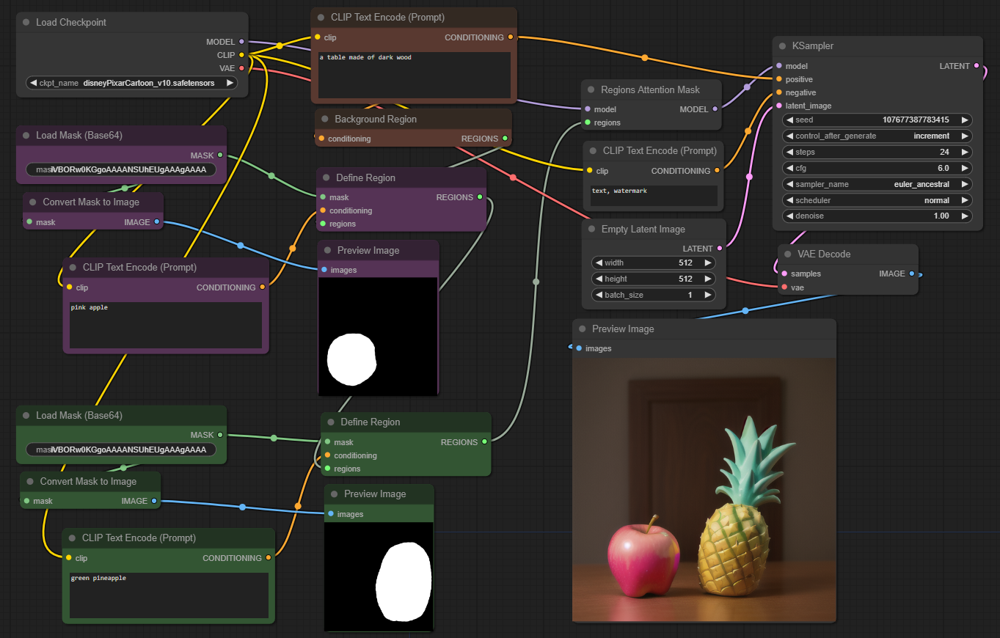
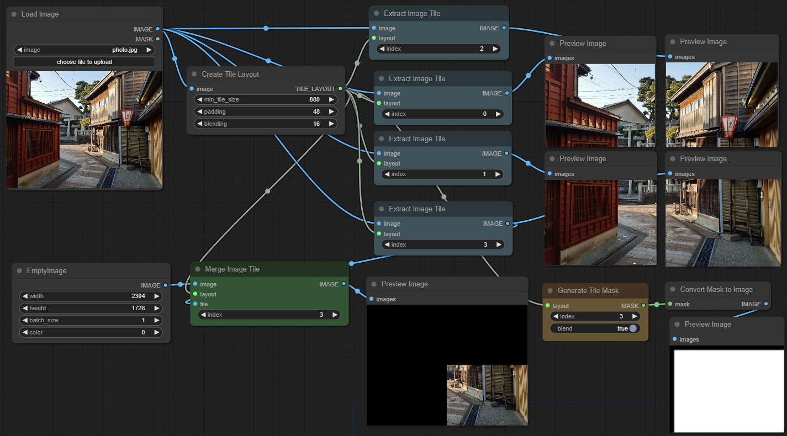

# ComfyUI Nodes for External Tooling

Provides nodes and API geared towards using ComfyUI as a backend for external tools.

* <a href="#images">Sending and receiving images</a>
* <a href="#regions">Regions (Attention Masking)
* <a href="#tiles">Tiled image processing
* <a href="#misc">Miscellanious nodes
* <a href="#api">Http API extensions (Model inspection)
* <a href="#installation">⭳ Installation</a>


## <a id="images" href="#toc">Sending and receiving images</a>

ComfyUI exchanges images via the filesystem. This requires a
multi-step process (upload images, prompt, download images), which
invites a whole class of potential issues you might not want to deal with.
It's also unclear at which point those images will get cleaned up if ComfyUI is used
via external tools.

### Load Image (Base64)

Loads an image from a PNG embedded into the prompt as base64 string.
* Inputs: base64 encoded binary data of a PNG image
* Outputs: image (RGB) and mask (alpha) if present

### Load Mask (Base64)

Loads a mask (single channel) from a PNG embedded into the prompt as base64 string.
* Inputs: base64 encoded binary data of a PNG image
* Outputs: the first channel of the image as mask

### Send Image (WebSocket)

Sends an output image over the client WebSocket connection as PNG binary data.
* Inputs: the image (RGB or RGBA)

This will first send one binary message for each image in the batch via WebSocket:
```
12<PNG-data>
```
That is two 32-bit integers (big endian) with values 1 and 2 followed by the PNG binary data. There is also a JSON message afterwards:
```
{'type': 'executed', 'data': {'node': '<node ID>', 'output': {'images': [{'source': 'websocket', 'content-type': 'image/png', 'type': 'output'}, ...]}, 'prompt_id': '<prompt ID>}}
```

## <a id="regions" href="#toc">Regions</a>

These nodes implement attention masking for arbitrary number of image regions. Text prompts only apply to the masked area.
In contrast to condition masking, this method is less "forceful", but leads to more natural image compositions.


[Workflow: region_attention_mask.json](workflows/region_attention_mask.json)

### Background Region

This node starts a list of regions. It takes a prompt, but no mask. The prompt is assigned to all image areas which are _not_
covered by another region mask in the list.

### Define Region

Appends a new region to a region list (or starts a new list). Takes a prompt, and mask which defines the area in the image
the prompt will apply to. Masks must be the same size as the image _or_ the latent (which is factor 8 smaller).

### List Region Masks

This node takes a list of regions and outputs all their masks. It can be useful for inspection, debugging or to reuse the
computed background mask.

### Regions Attention Mask

Patches the model to use the provided list of regions. This replaces the positive text conditioning which is provided
to the sampler. It's still possible to pass ControlNet and other conditioning to the sampler.

### Apply Mask to Image

Copies a mask into the alpha channel of an image.
* Inputs: image and mask
* Outputs: RGBA image with mask used as transparency


## <a id="tiles" href="#toc">Tiles</a>

Splitting an image into tiles to be processed individually is a useful method to speed up
diffusion and save VRAM. There are various nodes out there which provide a fixed pipeline.
In contrast, the following nodes only provide a way to split an image into tiles and merge
it back together. With tools and scripts it is feasible to generate individual workflows
for each tile. This allows maximum flexibility (different prompts, regions, control, etc.).


[Workflow: image_tiles.json](workflows/image_tiles.json)

### Create Tile Layout

This node defines the tiling parameters:
* **min_tile_size**: Minimum resolution of each tile in pixels. Tiles may be larger to fit the image size evenly.
* **padding**: Padding around each tile in pixels. Overlaps with neighbour tiles. There is no padding at the image borders.
* **blending**: The part of the padding area which is used for smooth blending to avoid seams. Affects masks which are generated from this layout.

The number of tiles is: `image_size // (min_tile_size + 2 * padding)`

### Extract Image Tile

Splits out part of an image. Tile indices range from 0 to number of tiles and are column-major
(tile 1 is usually below tile 0).

### Extract Mask Tile

Same as "Extract Image Tile" but for masks.

### Merge Image Tile

Merges a tile into a full image, usually after sampling. Uses a smooth transition overlap
between neighbouring tiles depending on padding and blending values.

### Generate Tile Mask

Creates a coverage mask for a certain tile. The size of the mask matches the image tile size.
The image area will be white (1) and the padding area black (0), with a smooth transition
depending on the chosen blend size. 

This mask is used internally by "Merge Image Tile", but it can also be useful as input for "Set Latent Noise Mask" in upscale workflows.


## <a id="misc" href="#toc">Miscellaneous Nodes</a>

<a id="node-translate"></a>
### Translate Text

Node which translates a string into English. The language to translate from is indicated with a
_language directive_ of the form `lang:xx` where xx is a 2-letter language code. Multiple
directives are allowed and change language for any text that comes after, until the next
directive. `lang:en` (the default) passes through text fragments untouched. Useful
for keywords, tags and such.

Examples:
| Input | Output |
|:-|:-|
| lang:de eine modische handtasche aus grünem kunstleder | a fashionable handbag made of green suede |
| origami paperwork, lang:zh 狐狸和鹤, lang:en mountain view | origami paperwork, Fox and crane, mountain view |

Translation happens entirely local, powered by [argosopentech/argos-translate](https://github.com/argosopentech/argos-translate):
* Install with `pip install argostranslate` or `pip install -r requirements.txt`
* Models are automatically downloaded on first use.

There is also a [translation API](#api-translation) for immediate feedback in tool UI.

### NSFW Filter

Checks images for NSFW content using [Safety-Checker](https://huggingface.co/CompVis/stable-diffusion-safety-checker). Images which don't pass the check are blurred to
obfuscate contents. Model is downloaded on first use.

Inputs: image and sensitivity (0.5 for explicit content only, 0.7+ to include partial nudity).

**Important:** the filter isn't perfect. Some explicit content may slip through.


## <a id="api" href="#toc">API extensions</a>

### GET /api/etn/model_info/{folder_name}

There are various types of models that can be loaded as checkpoint, LoRA, ControlNet, etc. which cannot be used interchangeably. This endpoint helps to categorize and filter them.

#### Paramters
* `folder_name`: sub-directory in ComfyUI's models folder.
  Supported model types: `checkpoints`, `diffusion_models`, `unet`, `unet_gguf`

#### Output
Lists available models with additional classification info:
```json
{
    "checkpoint_file.safetensors": {
        "base_model": "sd15",
        "is_inpaint": false,
        "type": "eps"
    },
    ...
}
```
Possible values for base model: `sd15, sd20, sd21, sd3, sdxl, sdxl-refiner, ssd1b, svd, cascade-b, cascade-c, aura-flow, hunyuan-dit, flux, flux-schnell, lumina2, chroma, qwen-image`

If base model is `sdxl`, the `type` attribute is set with possible values: `eps, edm, v-prediction, v-prediction-edm`

Detection supports quantized models:
* GGUF: if the `gguf` module is installed, .gguf files are detected and will set the `quant` field
* Nunchaku: SVDQuant models are detected and will set the `quant` field to `svdq`

Returns an entry `{"base_model": "unknown"}` for models with unknown format or which do not match any of the known base models.

### GET /api/etn/languages

Returns a list of available languages for translation.
```json
[
    { "name": "English", "code": "en" },
    { ... }
]
```

<a id="api-translation"></a>
### GET /api/etn/translate/{lang}/{text}

Translates `text` into English. `lang` is a 2-letter code indicating the language to translate
from. `text` may also contain _language directives_ to only translate some fragments.
See the [node documentation](#node-translate) for details.

* Output: JSON string
* Example: `/api/etn/translate/de/eine%20modische%20Handtasche` -> `"a fashionable handbag"`

### PUT /api/etn/upload/{folder_name}/{filename}

Uploads a model to ComfyUI's local model folder.

#### Parameters
* `folder_name`: the model type. Must match one of the existing folders in ComfyUI's models folder.
* `filename`: target filename for the model. Must not contain any (absolute or relative) path. Extension must be .safetensors.

#### Output
* Code `201` and `{ "status": "success" }` after successful upload.
* Code `200` and `{ "status": "cached" }` if the file already exists.
* Code `400` and `{ "error": "..." }` if the parameters are invalid.


## <a id="installation" href="#toc">Installation</a>

Download the repository and unpack into the `custom_nodes` folder in the ComfyUI installation directory.

Or clone via GIT, starting from ComfyUI installation directory:
```
cd custom_nodes
git clone https://github.com/Acly/comfyui-tooling-nodes.git
```

Restart ComfyUI and the nodes are functional.
